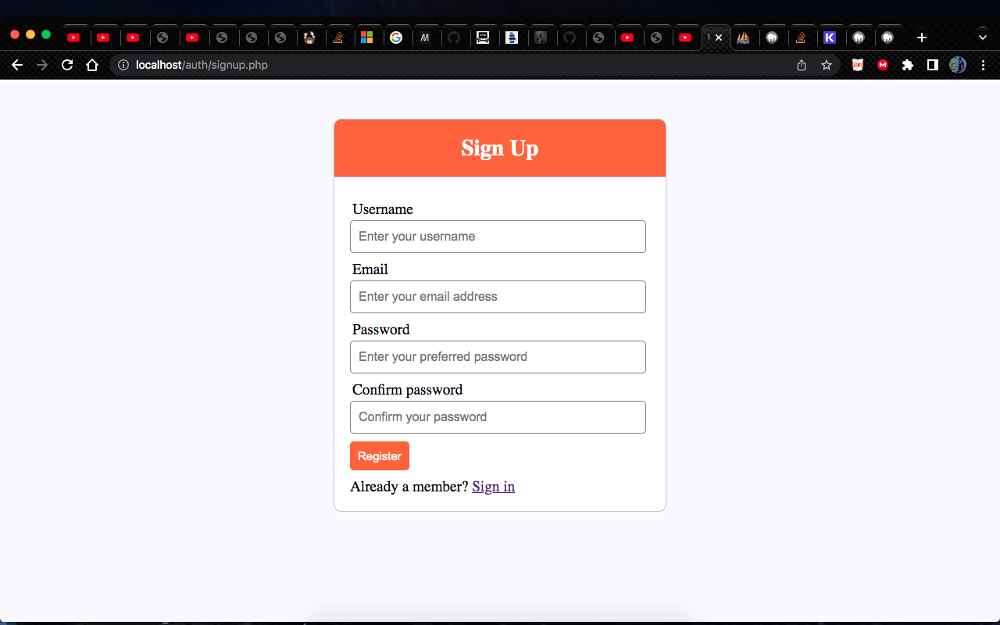

# imara
This is a template build on Procedural PHP that enables you to register and login users. Once a user is logged in, they are directed to the homepage which contains a welcome message with the users name and a logout button to kick users out.

## Getting Started/Setup

* `git clone this repo https://github.com/ngala21/imara.git`

* move the project `from your downloads folder to the htdocs directory`

##### Run the Project
* import register.sql to create the database otherwise connection will fail.
* Open MAMP/XAMPP
* Start Apache & MYSQL servers
* Go to your browser and enter the url localhost/auth

 I don't have any application installed to run php😐

#### Install PHP Application 

* brew install MAMP (if you are on macOS)
* Go to chrome and search for XAMPP (if you are on windows)

### Environment requirements 

* DB_HOST = "localhost", "127.0.0.1" as we are running it locally
* DB_USER= "root" is the default user
* DB_PASSWORD = "" Initial password is empty but I changed mine
* DB_NAME = name you have given you given your database
* ALLOWED_HOSTS='.localhost', '.127.0.0.1' 

* PHP
* HTML5
* CSS

## Deployment 

The project is not yet deployed as it is meant to run on host pc

## Authors

* **Ngala21** - *Initial work* - [Robot](https://github.com/ngala21)

## Support
* Incase of any issues reach me on ngalamike21@gmail.com
